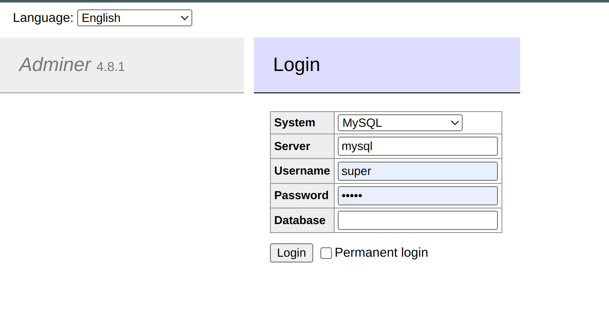
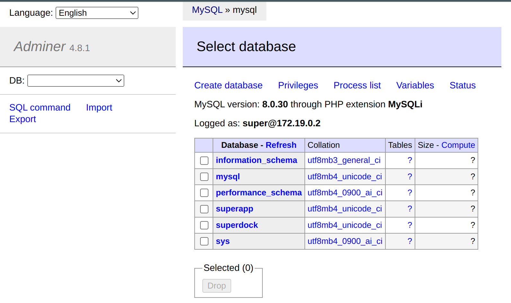

# Docker with Multiple MySQL DB
This is an example of MySQL container with few databases including Adminer for Database Management Tool.

Default MySQL image can create only one database out of the box, but we can customize it, adding SQL files to /docker-entrypoint-initdb.d directory.

Please notice, that MySQL will run these files only on container creation, and will not call them on next container start.

In this example we added SQL file with commands to run on container creation and create databases and grant all rights to them. We can create service and login to Adminer to check out fresh databases:

```
# start service
docker-compose up -d
```

Then go to localhost:8088 in your browser and login to database using username and password.
<p align="left">
  
</p>

Your databases are ready to use!
<p align="left">
  
</p>
